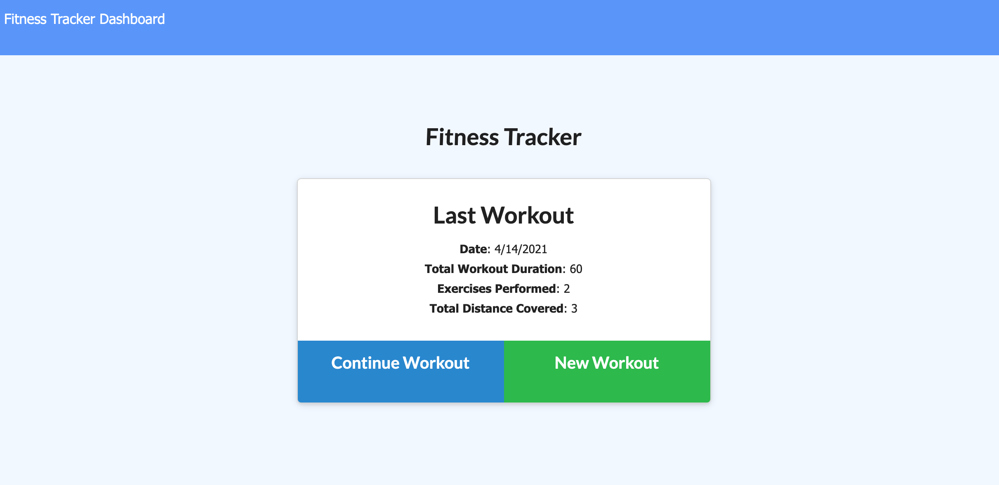
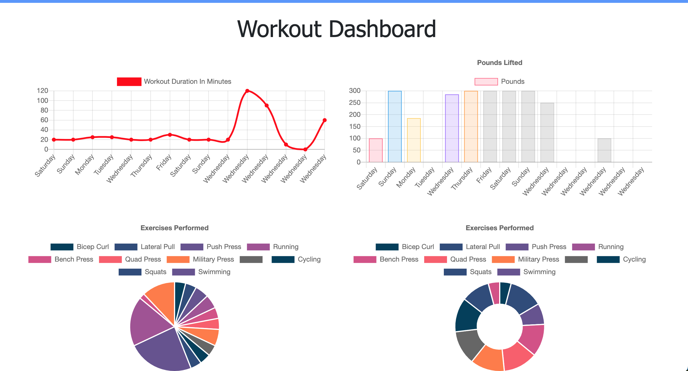

# Fitness Tracker

 

## Table of Contents
* [Project Overview](#Project-Overview)
* [Application](#Application)
* [Installation](#Installation)
* [License](#License)
* [Questions](#Questions)

## Project Overview

This application is a fully functional fitness tracker where users can log their latest workouts and keep track of their progress on the dashboard. The user will be able to see the last 7 days of workouts along with the total duration of time spent working to reach their fitness goals. 

## Application
[Fitness Tracker Heroku Link](https://whispering-escarpment-18429.herokuapp.com/?id=607867796dc8240015dd3ec1)

## Installation

To properly run this application you will need to initialize your project by running a npm init -y and then npm install the following dependencies: 

* express
* mongoose
* morgon

Once the dependencies have been installed you will need to run the following commands in your terminal to seed the database and begin listening on your server port.

1. npm run seed
2. npm start

After that is complete you will need to deploy the application to Heroku or a similar hosting site to view the fitness tracker online. 

## License

You can find out more about the MIT license on the open source page [here](https://www.opensource.org/licenses/MIT)

## Questions

Please contact me via email if you have any questions about this application.

* GitHub Profile: [github.com/marisanesmith](github.com/marisanesmith)

* Email: [marisanesmith@yahoo.com](marisanesmith@yahoo.com)